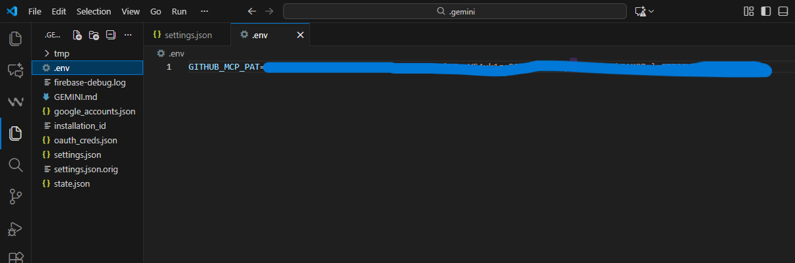

# 🔵 AIDD 30-Day Challenge — Task 6 🔵

## 🚀 Connecting GitHub with Gemini CLI using MCP

---

## 🎯 Objective

Enable secure **AI-powered interaction with GitHub repositories** through the Gemini CLI using the GitHub MCP Server.

---

## ✅ Steps Completed

### **1️⃣ Create GitHub Personal Access Token (PAT)**

Go to:

```
https://github.com/settings/personal-access-tokens/new
```

Generate a **Fine-grained PAT** with:

- ✔ **repo (Read & Write)**

---

### **2️⃣ Store Token Securely in `.env` File**

Create a `.env` file inside your Gemini CLI directory:



⚠ **Do NOT place the token inside `settings.json`.**

---

### **3️⃣ Configure `settings.json` for the GitHub MCP Server**

Create or edit:

.png)


---

### **4️⃣ Restart the Gemini CLI**

```bash
gemini
```

---

### **5️⃣ Verify MCP Server Connection**

Run:

```bash
/mcp list
```
.png)

✔ GitHub MCP Server successfully detected.

---

### **6️⃣ Test the GitHub MCP Server**

Ask Gemini:

> List my GitHub repositories

.png)
.png)

✔ Gemini returned all my repository names — confirming full integration.

---

## 🏁 Task 06 Completed Successfully

| Step | Status |
|------|--------|
| 🔐 PAT created | ✔ |
| 📂 Token stored in `.env` | ✔ |
| ⚙️ `settings.json` configured | ✔ |
| 🔄 Gemini CLI restarted | ✔ |
| 🌐 MCP server detected | ✔ |
| 📁 Repositories listed | ✔ |

---

## 📦 Final Result

The **GitHub MCP Server** is now fully integrated with the **Gemini CLI**, enabling seamless AI-driven access to my GitHub repositories.

---
If you want the same in:

✨ Docusaurus Blog
✨ GitHub Wiki format
✨ More icons + badges

Just tell me!


