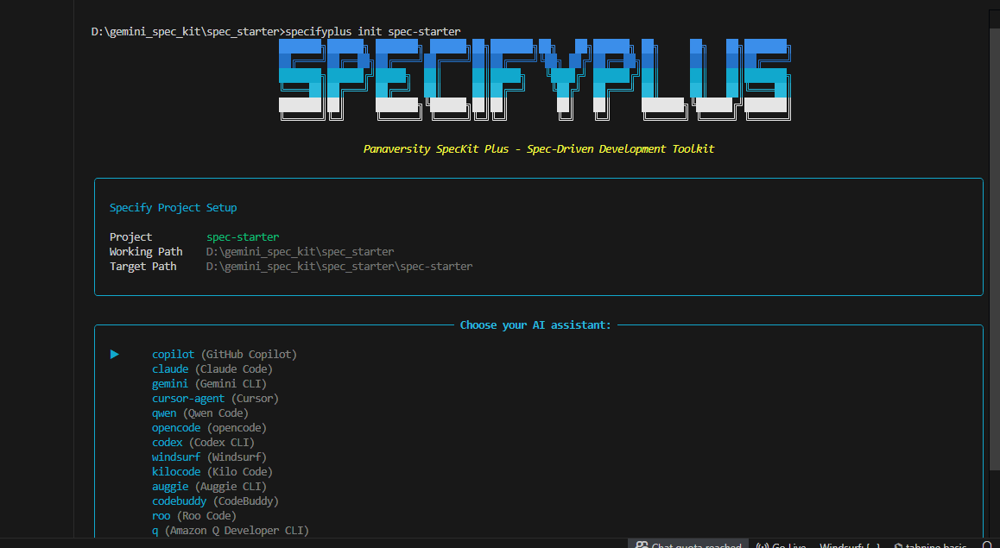
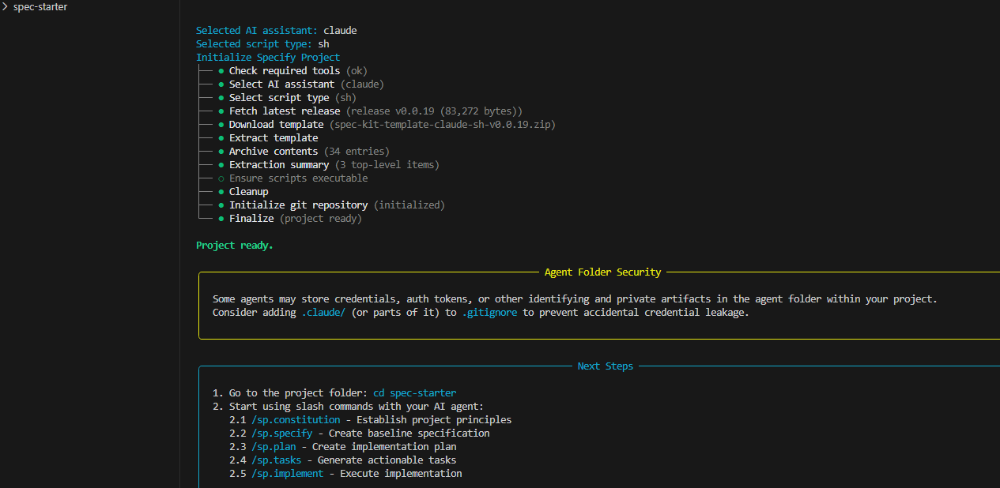

# 🧠 AIDD 30-Day Challenge — Task 7 🧠

---

## 🔧 Installation of **Spec-Kit Plus**

To install Spec-Kit Plus, ensure **Python 3.12+** is installed.

### 📥 Install Command
```bash
pip install specifyplus
```
### 🔍 Check Version
```bash
specifyplus --version
```
### Eample Output
```bash
SpecifyPlus CLI v0.0.17
```
## 🚀 Getting Started with Spec-Kit Plus

### Step-by-step Setup

1. 📁 **Create a folder** named `spec-starter`
2. 🖥️ **Open the folder** in your CMD / Terminal
3. ▶️ **Run the initialization command:**

```bash
specifyplus init .
```

4. 🤖 **Select your AI assistant** (Gemini, Claude, etc.)

5. 💻 **Select script type** (Bash or PowerShell)

6. 🏗️ **Spec-Kit Plus initializes the project structure automatically**
---



# ✅ What is Spec-Kit Plus?

Spec-Kit Plus is a modern **AI-assisted development framework** that helps developers work in a structured way with coding agents like **GitHub Copilot**, **Claude Code**, and **Gemini**.  
It uses the **SDD-RI method** (Specification-Driven Development with Reusable Intelligence), meaning you define:

- 🎯 Rules  
- 📘 Requirements  
- 🏗️ Architecture  

**before AI writes the code.**

Spec-Kit Plus follows the **Two-Output Philosophy**:

- 🧩 **Temporary Output:** Working code  
- 🧠 **Permanent Output:** Reusable intelligence (documentation, reasoning, patterns)

This makes AI-generated code:

- More reliable  
- More consistent  
- Better aligned with project standards  
- Long-term friendly for human + AI collaboration  

---

# 🧠 Core Phases of Spec-Kit Plus


## ➡️ 1. **Constitution Phase – Set the Project Rules First** 📜

In this phase, you define the fundamental rules for the entire project, such as:

- Coding standards  
- Architecture guidelines  
- Naming conventions  
- Quality requirements  

These rules act as a **project constitution** that both developers and AI agents must follow throughout the workflow.

---

## ➡️ 2. **Specify Phase – Describe What the Feature Should Do** 🧾

Here you write **clear, structured, testable requirements** for each feature.  
You explain:

- What the feature must achieve  
- How it should behave  
- What the user expects  

This document becomes the **primary guide for AI** when generating code.

---

## ➡️ 3. **Clarify Phase – Remove Confusion & Fill Missing Details** 🔍

After writing the initial requirements, you refine them by:

- Clearing vague statements  
- Resolving open questions  
- Adding missing details  

This ensures the AI has a **complete and accurate understanding** of the feature before coding begins.

---

## ➡️ 4. **Plan –  Architecture and Decisions**

The `/plan` phase generates the implementation plan, architecture decisions, and technology choices.  
It answers **how** the feature will be built and records the reasoning in **ADRs (Architectural Decision Records)**.  
This preserves long-term intelligence about why certain approaches were chosen.

---

## ➡️ 5. **/tasks –  Break Work Into Small Units**

The `/tasks` command breaks the plan into **atomic, measurable tasks**.  
Each task becomes a small, clear unit of work with checkpoints and validation steps.  
This avoids confusion, simplifies implementation, and guides the AI effectively during coding.

## ➡️ 6. **Implement Phase – Generate Code + Reusable Intelligence** ⚙️🤖

Finally, the AI generates:

- 💻 The actual working code  
- 🧠 Reusable intelligence  
  - Patterns  
  - Documentation  
  - Reasoning  
  - Explanations  

Every feature produces **both** code and knowledge, making your entire AI-assisted workflow stronger over time.

--- 

## 🚀 Map of Core Concepts:
```bash
Clear Constitution
    ↓
(ensures every spec respects quality standards)
    ↓
Clear Specification
    ↓
(ensures planning accounts for quality gates)
    ↓
Clear Plan
    ↓
(ensures tasks include verification)
    ↓
Clear Tasks
    ↓
(enables AI to generate properly cited writing)
    ↓
Implemented / Applied Work

```